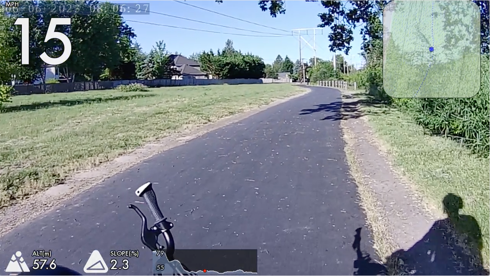

# Bike Cam Map Overlay

On my Tern GSD electric cargo bike I keep a dashcam hooked up to record road conditions, etc. I wanted a way to annotate those videos with maps and other data and was happy to find [time4tea/gopro-dashboard-overlay](https://github.com/time4tea/gopro-dashboard-overlay). 

Included in this repo is the layout.xml ([docs](https://github.com/time4tea/gopro-dashboard-overlay/tree/main/docs/xml/examples)) file I use for the 720p recordings from my [Akaso Brave dashcam](https://www.akasotech.com). I use [OsmAnd Maps Travel & Navigate](https://apps.apple.com/us/app/osmand-maps-travel-navigate/id934850257) to record my GPS.

```
./bin/gopro-dashboard.py --font Futura --use-gpx-only --gpx ~/Downloads/2023-06-06_07-47_Tue.gpx /Volumes/NO\ NAME/DCIM/100HSCAM/NORM0007.MP4  test.mp4 --overlay-size 1280x720 --layout xml --layout-xml layout.xml 
```


